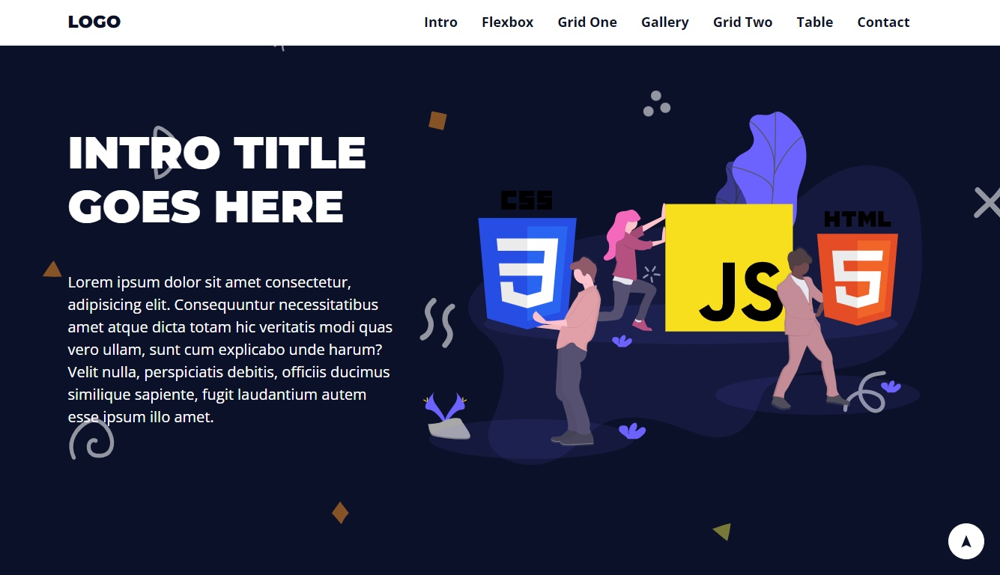
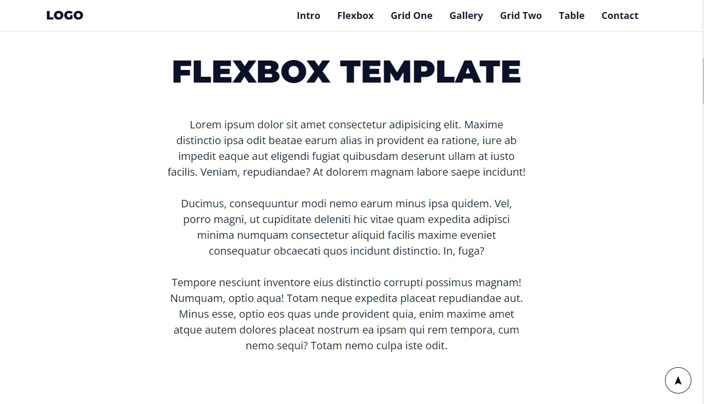
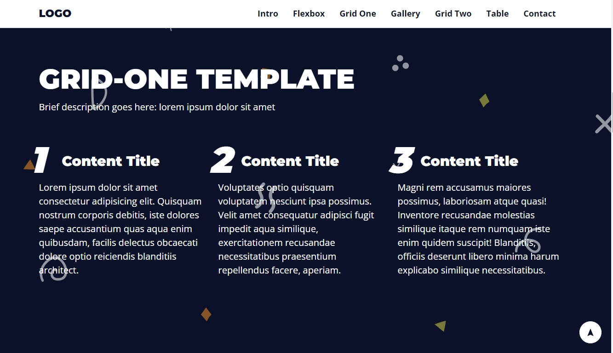
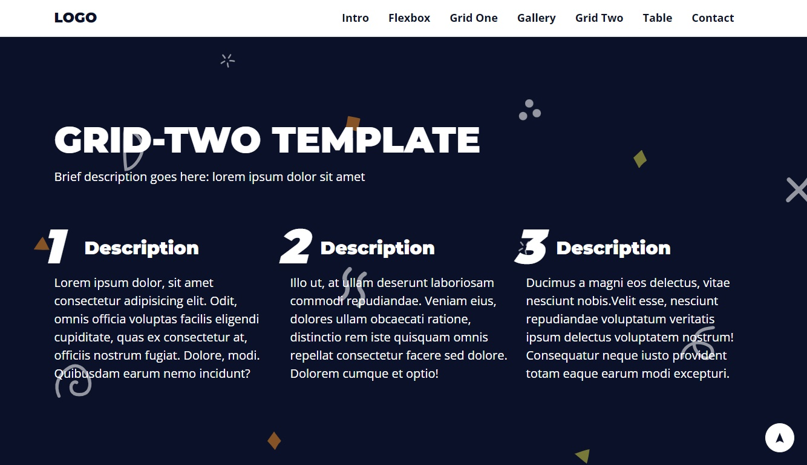
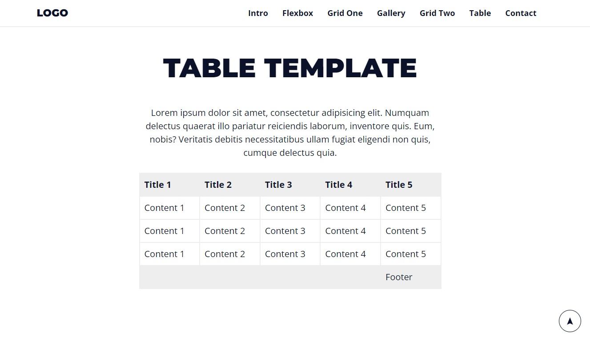
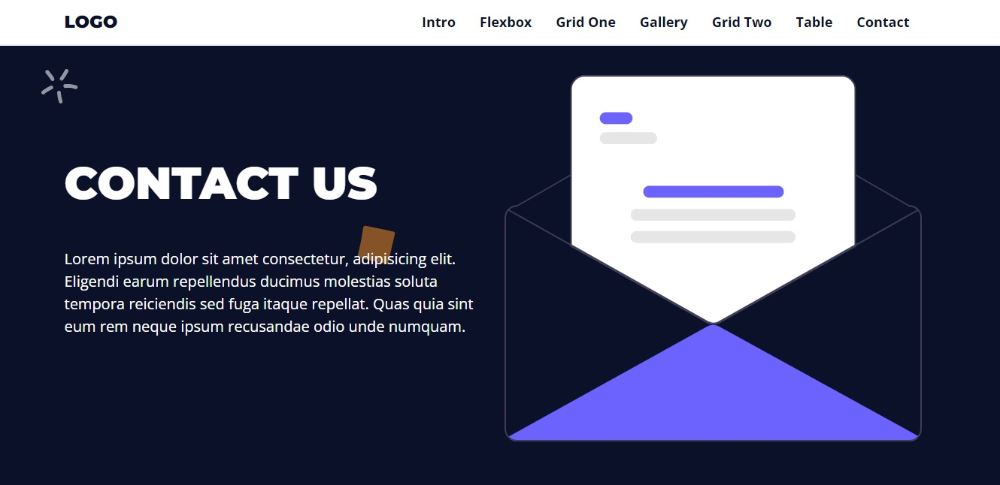
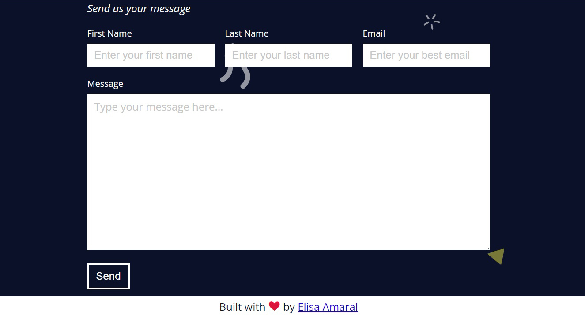

# Responsive One-Page Website Template built with HTML and CSS

This project is a detailed responsive one-page website template. The project was entirely coded in HTML and CSS, no front-end frameworks were used. The purpose of the project was to structure a one-page website that contained HTML/CSS elements that are useful for one-page applications, such as grids, flexboxes, tables and forms. All the links in the top navbar anchor to different sections of the page.

## Project Website

**https://responsive-one-pager-template.netlify.app/**

## Screenshot 1: Intro Template

## Screenshot 2: Flexbox Template

## Screenshot 3: Grid-One Template

## Screenshot 4: Gallery Template

## Screenshot 5: Grid-Two Template

## Screenshot 6: Table Template

## Screenshot 7: Contact Us Teamplate (part 1)

## Screenshot 8:  Contact Us Teamplate (part 2) + Footer

